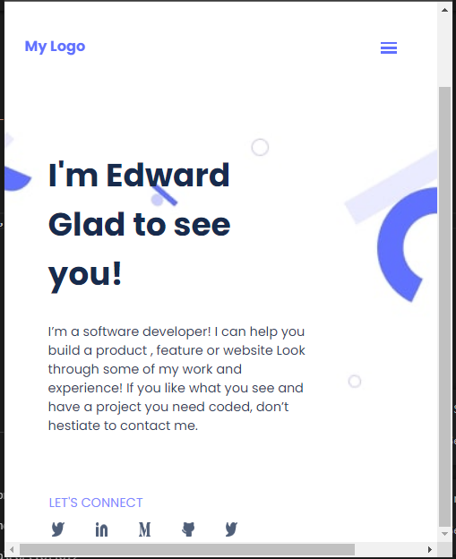

# Project Name

> One paragraph statement about the project.

Additional description about the project and its features.

## Built With

- Major languages:HTML,CSS,JavaScript
- Frameworks:no frame works used
- Technologies used:webhint,stylehint and lighthouse

## Live Demo

[Live Demo Link](https://oluyaratosin123.github.io/Portfolio1/)

## Getting Started

To get a local copy up and running follow these simple example steps.

### Prerequisites
-Github

### Setup
-git clone https://github.com/oluyaratosin123/Portfolio1.git

### Install
-Run npm install

### Usage
-Open index.html to view in browser

## Authors

👤 **Author1**

- GitHub: [@githubhandle](https://github.com/oluyaratosin123)
- LinkedIn: [LinkedIn](https://www.linkedin.com/in/edward-oluyara-708b88215/)

## 🤝 Contributing

Contributions, issues, and feature requests are welcome!

Feel free to check the [issues page](../../issues/).

## Show your support

Give a ⭐️ if you like this project!

## Acknowledgments

- Hat tip to anyone whose code was used
- Inspiration
- etc

## 📝 License

This project is [MIT](./MIT.md) licensed.
